# 🐾 Pet Shelter Management API

[](https://www.oracle.com/java/technologies/downloads/)
[](https://spring.io/projects/spring-boot)
[](https://www.postgresql.org/)
[](https://www.rabbitmq.com/)
[](https://junit.org/junit5/)
[](https://www.docker.com/)
[](https://deepwiki.com/nataliadiotto/pet-shelter-springboot-refactoring)

A RESTful API built with Java 21 and Spring Boot for managing pet records in a shelter environment.

This API represents the complete modernization of my foundational pure Java CLI application ([Pet Shelter - CLI](https://github.com/nataliadiotto/pet-shelter-cli)) into a scalable microservice. It demonstrates my understanding of modern backend development principles, including layered architecture, asynchronous processing, external API consumption, comprehensive testing, and detailed API documentation.

The application is part of the challenge created by Lucas Carrilho ([@devmagro](https://x.com/devmagro)). Access the original CLI project's [README](https://github.com/karilho/desafioCadastro?tab=readme-ov-file#desafio-programação---sistema-de-cadastros-) for further information.

-----

## ✨ Key Features

- **Dynamic & Scalable Filtering**: Utilizes **JPA Specifications** to build complex, multi-parameter database queries on the fly.
- **Event-Driven & Asynchronous**: Integrates with **RabbitMQ** and **Spring Mail** to decouple processes like sending email notifications.
- **External API Integration**: Consumes the [ViaCep API](https://viacep.com.br/) using **OpenFeign** to retrieve zip codes from given address details.
- **Comprehensive Testing**: Employs **JUnit 5 & Mockito** with a clear, layer-by-layer testing strategy.
- **Containerized Environment**: Comes with a `docker-compose.yml` file for easily setting up PostgreSQL and RabbitMQ.
- **Rich API Documentation**: Auto-generates interactive API documentation using **OpenAPI (Swagger)** with detailed examples and schemas.

-----

## 🛠️ Architectural Deep Dive

This project began as a command-line application built with pure Java to solidify foundational concepts. The refactoring into a Spring Boot API was undertaken to apply and master industry-standard technologies and architectural patterns.

### The Evolution: From CLI to Microservice

| Feature | Original CLI Application | Modern Spring Boot API |
| :--- | :--- | :--- |
| **User Interface** | Command-Line Interface (CLI) | RESTful API |
| **Persistence** | Individual Text Files (`.txt`) | **PostgreSQL** Relational Database |
| **Data Access** | Manual Java I/O | **Spring Data JPA** & Hibernate |
| **Filtering Logic** | Custom **Strategy Pattern** | **JPA Specifications** |
| **External APIs** | N/A | **OpenFeign** REST Client |
| **Notifications** | N/A | **Event-Driven** via **RabbitMQ** & **Email Service** |
| **Environment** | Manual `java` execution | **Dockerized** (PostgreSQL, RabbitMQ) |
| **Testing** | Manual | **Comprehensive Unit Tests** (JUnit, Mockito) |

### From Strategy Pattern to JPA Specifications

A key feature of the original CLI was its flexible filtering capability, built using the **Strategy Design Pattern**. Each filter (by name, age, etc.) was an encapsulated strategy.

To preserve this dynamic querying capability, the **JPA Criteria API** and **Spring Data JPA Specifications** were chosen as the natural evolution. This approach allows for building complex, type-safe queries on the fly by chaining individual specification objects, providing a clean, scalable, and highly flexible filtering solution directly at the database level.

```java
// Dynamically chaining Specifications in the service layer
public List<Pet> findPetsByCriteria(PetFilterDTO filter) {
    Specification<Pet> spec = Specification.where(null); // Start with an empty specification

    if (filter.getType() != null) {
        spec = spec.and(PetSpecifications.hasType(filter.getType()));
    }
    if (filter.getGender() != null) {
        spec = spec.and(PetSpecifications.hasGender(filter.getGender()));
    }
    // ... and so on for all other criteria
    return petRepository.findAll(spec);
}
```

### Declarative REST Client with OpenFeign

To enrich the pet's location data, the application integrates with the external **ViaCep API**. Instead of using a manual `RestTemplate` or `WebClient`, this project leverages **OpenFeign**, a declarative REST client.

This approach simplifies external API consumption. By simply defining a Java interface with annotations, OpenFeign automatically generates the implementation required to make HTTP requests, handle parameters, and deserialize JSON responses. This results in cleaner, more readable, and less error-prone service-layer code.

```java
// Feign Client interface makes consuming the API as simple as calling a method.
@FeignClient(name = "viacep", url = "https://viacep.com.br/ws")
public interface ViaCepClient {

    @GetMapping("/{cep}/json")
    AddressDTO getAddressByCep(@PathVariable("cep") String cep);
}
```

### Event-Driven Notifications with RabbitMQ 

To ensure the system is responsive, an event-driven approach is used for post-registration actions. When a new pet is successfully saved to the database, the `PetService` delegates to a `PetEventPublisher`.

This publisher sends a message to a RabbitMQ exchange, completely decoupling the core registration process from the notification logic. A separate consumer listens to the queue, processes the message, and invokes the `EmailService` to send a confirmation email.

```mermaid
graph TD
    Client -->|Sends POST /api/v1/pets| PetService
    
    PetService -->|Saves data to| Database
    PetService -->|Publishes event to| RabbitMQ_Exchange
    PetService -->|Returns HTTP 201 Created| Client
    
    RabbitMQ_Exchange -- "via Binding" --> Queue
    Queue -->|Message is delivered| EmailConsumer
    EmailConsumer -->|Invokes| EmailService
    EmailService -->|Sends Notification| Email[📧 Notification Email]
```



#### **📧 Example notification:**


## 📚 Tech Stack

| Tool/Library | Purpose |
| :--- | :--- |
| **Java 21** | Core programming language |
| **Spring Boot 3.4.3** | Application framework |
| **Spring Data JPA** | ORM for persistence layer |
| **PostgreSQL** | Relational database |
| **RabbitMQ** | Asynchronous messaging queue |
| **Spring AMQP** | RabbitMQ integration |
| **Spring Mail** | Email sending service |
| **OpenFeign** | Declarative REST client for external API consumption |
| **Springdoc OpenAPI**| API documentation (Swagger UI) |
| **JUnit 5 & Mockito**| Unit & integration testing |
| **ModelMapper** | DTO to Entity mapping |
| **Docker & Docker Compose**| Containerization for local infrastructure |
| **Maven** | Dependency management |

-----

## 📡 API Documentation with Swagger

The API is fully documented using OpenAPI 3.0, providing an interactive UI to explore and test the endpoints. The documentation is enriched with detailed descriptions, examples, and schema information using Springdoc annotations (`@Operation`, `@ApiResponse`, `@Schema`, etc.) for maximum clarity.

**Access the Swagger UI here:** [http://localhost:8080/swagger-ui/index.html](http://localhost:8080/swagger-ui/index.html)

A key focus was to provide clear request and response examples, including detailed schemas and multiple response codes for both success and error scenarios.

-----

## 🧪 Comprehensive Testing Strategy

A robust testing strategy was implemented to ensure code quality and reliability, covering all layers of the application.

- **Controller Layer (`@WebMvcTest`):** Tests focus on validating HTTP endpoints, request/response status codes, and ensuring correct delegation to the service layer.
- **Service Layer (`@ExtendWith(MockitoExtension.class)`):** Core business logic is tested in isolation. Dependencies like repositories and publishers are mocked to verify interactions (e.g., "was the save method called?," "was an event published?").
- **Publisher & Consumer Classes:** Unit tests verify that the publisher correctly formats and sends messages and that the consumer correctly processes incoming messages and calls the appropriate service. `ArgumentCaptor` is used extensively to inspect objects passed between components.
- **Email Service:** Unit tests mock the `JavaMailSender` to verify that emails are constructed with the correct recipient, subject, and body, without sending any actual emails.

-----

## 🚀 How to Run Locally

### Prerequisites

* Java (JDK) 21 or later
* Docker and Docker Compose
* Maven

### Installation & Setup

1.  **Clone the repository:**

    ```sh
    git clone https://github.com/nataliadiotto/pet-shelter-springboot-refactoring.git
    cd pet-shelter-springboot-refactoring
    ```

2.  **Configure Environment Secrets:**
    The project uses a profile-based configuration. Create an `application-dev.properties` file inside `src/main/resources`. **This file is git-ignored and must contain your secrets.**

    ```properties
    # src/main/resources/application-dev.properties

    # PostgreSQL Credentials
    spring.datasource.username=admin
    spring.datasource.password=admin

    # RabbitMQ Credentials
    spring.rabbitmq.username=guest
    spring.rabbitmq.password=guest

    # Gmail SMTP Credentials (use a Google App Password)
    spring.mail.username=your-email@gmail.com
    spring.mail.password=your-google-app-password
    ```

3.  **Launch Docker Containers:**
    Start the PostgreSQL and RabbitMQ services using Docker Compose.

    ```sh
    docker-compose up -d
    ```

4.  **Run the Spring Boot Application:**

    ```sh
    ./mvnw spring-boot:run
    ```

5.  **You're all set\! Access the services:**

   * **API (Swagger UI):** [http://localhost:8080/swagger-ui/index.html](https://localhost:8080/swagger-ui/index.html)
   * **RabbitMQ Management Console:** [http://localhost:15672](https://localhost:15672) (guest / guest)

-----

## 🌱 Future Improvements

- [ ] **Security:** Implement endpoint security using Spring Security and JWT.
- [ ] **Pagination & Sorting:** Add pagination and sorting capabilities to the `GET /pets` endpoint.
- [ ] **Integration Testing:** Enhance the test suite with integration tests using **Testcontainers**.
- [ ] **Cloud Deployment:** Deploy the application to a cloud provider like Heroku or AWS.
- [ ] **CI/CD:** Set up a Continuous Integration/Continuous Deployment pipeline using GitHub Actions.

-----

### Original Project

You can view the original pure Java CLI application that inspired this refactoring [in its own repository](https://github.com/nataliadiotto/pet-shelter).
### ⭐ Show Your Support

> If you find this project helpful, please ⭐ the com.diotto.petshelter.repository!


